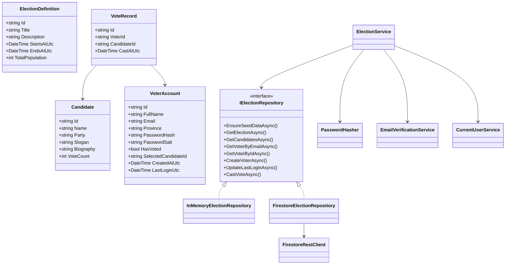

# Class Diagram

```mermaid
classDiagram
    class Candidate {
        +string Id
        +string Name
        +string Party
        +string Slogan
        +string Biography
        +int VoteCount
    }

    class ElectionDefinition {
        +string Id
        +string Title
        +string Description
        +DateTime StartsAtUtc
        +DateTime EndsAtUtc
        +int TotalPopulation
    }

    class VoterAccount {
        +string Id
        +string FullName
        +string Email
        +string Province
        +string PasswordHash
        +string PasswordSalt
        +bool HasVoted
        +string SelectedCandidateId
        +DateTime CreatedAtUtc
        +DateTime LastLoginUtc
    }

    class VoteRecord {
        +string Id
        +string VoterId
        +string CandidateId
        +DateTime CastAtUtc
    }

    class IElectionRepository {
        <<interface>>
        +EnsureSeedDataAsync()
        +GetElectionAsync()
        +GetCandidatesAsync()
        +GetVoterByEmailAsync()
        +GetVoterByIdAsync()
        +CreateVoterAsync()
        +UpdateLastLoginAsync()
        +CastVoteAsync()
    }

    class InMemoryElectionRepository
    class FirestoreElectionRepository
    class ElectionService
    class PasswordHasher
    class EmailVerificationService
    class FirestoreRestClient
    class CurrentUserService

    IElectionRepository <|.. InMemoryElectionRepository
    IElectionRepository <|.. FirestoreElectionRepository
    ElectionService --> IElectionRepository
    ElectionService --> PasswordHasher
    ElectionService --> EmailVerificationService
    ElectionService --> CurrentUserService
    FirestoreElectionRepository --> FirestoreRestClient
    VoteRecord --> Candidate
    VoteRecord --> VoterAccount
```
