# EVoting System

ASP.NET Core MVC prototype for the INF4027W election platform brief.

## Stack

- Backend: C# with ASP.NET Core MVC
- Authentication: cookie auth with PBKDF2 password hashing
- NoSQL database: Firebase Cloud Firestore via REST API
- Guest view: public live results dashboard
- Voter flow: register, login, vote once

## What is implemented

- Candidate data seeded from configuration into the repository
- Public dashboard with live percentages, total votes, and turnout out of 100
- Registration with disposable email screening through UserCheck/MailCheck-compatible API
- Voter login and single-vote enforcement
- Transaction-oriented Firestore vote recording with atomic candidate vote increments
- Province captured during sign-up for the bonus requirement

## Class diagram

```mermaid
classDiagram
    direction TB

    class IdentityUser {
        <<Framework Base>>
        +string Id
        +string UserName
        +string NormalizedUserName
        +string Email
        +string NormalizedEmail
        +bool EmailConfirmed
        +string PasswordHash
        +string SecurityStamp
        +string ConcurrencyStamp
        +string PhoneNumber
        +bool LockoutEnabled
        +int AccessFailedCount
    }

    class ApplicationUser {
        +string FullName
        +string ProvinceCode
        +bool HasVoted
        +bool MailcheckValidated
        +string MailcheckStatus
        +DateTime RegisteredAtUtc
    }

    class Province {
        +string Code
        +string Name
        +bool IsActive
    }

    class Candidate {
        +string Id
        +string FullName
        +string PartyName
        +string ManifestoSummary
        +string ImageUrl
        +int DisplayOrder
        +int VoteCount
        +bool IsActive
    }

    class Vote {
        +string Id
        +string ElectionId
        +string CandidateId
        +string VoterId
        +DateTime CreatedAtUtc
    }

    class ElectionStats {
        +string ElectionId
        +int TotalVotesCast
        +int PopulationSize
        +decimal TurnoutPercentage
        +DateTime UpdatedAtUtc
    }

    class PollResultRow {
        +string CandidateId
        +string CandidateName
        +string PartyName
        +int VoteCount
        +decimal VotePercentage
    }

    class RegisterRequestModel {
        +string FullName
        +string Email
        +string Password
        +string ConfirmPassword
        +string ProvinceCode
    }

    class VoteSubmissionModel {
        +string CandidateId
    }

    class ResultViewModel {
        +string ElectionTitle
        +int TotalVotes
        +int PopulationSize
        +decimal TurnoutPercentage
        +List~PollResultRow~ Results
    }

    class EmailVerificationResultModel {
        +bool IsAllowed
        +string NormalizedEmail
        +string Reason
        +string RiskLevel
    }

    class BallotViewModel {
        +string VoterName
        +bool AlreadyVoted
        +List~Candidate~ Candidates
    }

    class FirestoreUserDocument {
        +string Id
        +string Email
        +string NormalizedEmail
        +string UserName
        +string NormalizedUserName
        +string PasswordHash
        +string FullName
        +string ProvinceCode
        +bool HasVoted
        +bool MailcheckValidated
        +string MailcheckStatus
        +string SecurityStamp
        +string ConcurrencyStamp
        +DateTime RegisteredAtUtc
    }

    class FirestoreCandidateDocument {
        +string Id
        +string FullName
        +string PartyName
        +string ManifestoSummary
        +string ImageUrl
        +int DisplayOrder
        +int VoteCount
        +bool IsActive
    }

    class FirestoreVoteDocument {
        +string Id
        +string ElectionId
        +string CandidateId
        +string VoterId
        +DateTime CreatedAtUtc
    }

    class FirestoreElectionStatsDocument {
        +string ElectionId
        +int TotalVotesCast
        +int PopulationSize
        +DateTime UpdatedAtUtc
    }

    class IEmailValidationService {
        <<interface>>
        +Task~EmailVerificationResultModel~ ValidateAsync(string email, CancellationToken ct)
    }

    class IResultsService {
        <<interface>>
        +Task~ResultViewModel~ GetPublicResultsAsync(CancellationToken ct)
    }

    class IVotingService {
        <<interface>>
        +Task~BallotViewModel~ GetBallotAsync(string userId, CancellationToken ct)
        +Task~bool~ CastVoteAsync(string userId, VoteSubmissionModel model, CancellationToken ct)
    }

    class IAccountService {
        <<interface>>
        +Task~IdentityResult~ RegisterAsync(RegisterRequestModel model, CancellationToken ct)
        +Task~SignInResult~ LoginAsync(string email, string password, bool rememberMe)
    }

    class ICandidateRepository {
        <<interface>>
        +Task~IReadOnlyList~Candidate~~ GetActiveCandidatesAsync(CancellationToken ct)
        +Task~Candidate?~ GetByIdAsync(string candidateId, CancellationToken ct)
    }

    class IUserRepository {
        <<interface>>
        +Task~ApplicationUser?~ GetByIdAsync(string userId, CancellationToken ct)
        +Task~ApplicationUser?~ GetByEmailAsync(string email, CancellationToken ct)
        +Task UpdateAsync(ApplicationUser user, CancellationToken ct)
    }

    class IVoteRepository {
        <<interface>>
        +Task~bool~ ExistsForVoterAsync(string electionId, string voterId, CancellationToken ct)
        +Task CreateAsync(Vote vote, CancellationToken ct)
    }

    class IElectionStatsRepository {
        <<interface>>
        +Task~ElectionStats~ GetCurrentAsync(CancellationToken ct)
        +Task UpdateAsync(ElectionStats stats, CancellationToken ct)
    }

    class IFirestoreVotingTransaction {
        <<interface>>
        +Task~bool~ CastVoteAtomicallyAsync(string electionId, string voterId, string candidateId, CancellationToken ct)
    }

    class EmailValidationService {
        +Task~EmailVerificationResultModel~ ValidateAsync(string email, CancellationToken ct)
    }

    class ResultsService {
        +Task~ResultViewModel~ GetPublicResultsAsync(CancellationToken ct)
    }

    class VotingService {
        +Task~BallotViewModel~ GetBallotAsync(string userId, CancellationToken ct)
        +Task~bool~ CastVoteAsync(string userId, VoteSubmissionModel model, CancellationToken ct)
    }

    class AccountService {
        +Task~IdentityResult~ RegisterAsync(RegisterRequestModel model, CancellationToken ct)
        +Task~SignInResult~ LoginAsync(string email, string password, bool rememberMe)
    }

    class FirestoreCandidateRepository
    class FirestoreUserRepository
    class FirestoreVoteRepository
    class FirestoreElectionStatsRepository
    class FirestoreVotingTransaction

    IdentityUser <|-- ApplicationUser

    ApplicationUser --> Province : optional
    Vote --> ApplicationUser : cast by
    Vote --> Candidate : for
    ElectionStats o-- PollResultRow : aggregates
    ResultViewModel o-- PollResultRow : contains
    BallotViewModel o-- Candidate : shows

    FirestoreUserDocument ..> ApplicationUser : maps to
    FirestoreCandidateDocument ..> Candidate : maps to
    FirestoreVoteDocument ..> Vote : maps to
    FirestoreElectionStatsDocument ..> ElectionStats : maps to

    EmailValidationService ..|> IEmailValidationService
    ResultsService ..|> IResultsService
    VotingService ..|> IVotingService
    AccountService ..|> IAccountService

    FirestoreCandidateRepository ..|> ICandidateRepository
    FirestoreUserRepository ..|> IUserRepository
    FirestoreVoteRepository ..|> IVoteRepository
    FirestoreElectionStatsRepository ..|> IElectionStatsRepository
    FirestoreVotingTransaction ..|> IFirestoreVotingTransaction

    AccountService --> IEmailValidationService
    AccountService --> IUserRepository
    VotingService --> IUserRepository
    VotingService --> ICandidateRepository
    VotingService --> IVoteRepository
    VotingService --> IElectionStatsRepository
    VotingService --> IFirestoreVotingTransaction
    ResultsService --> ICandidateRepository
    ResultsService --> IElectionStatsRepository
```



## Local run

```bash
cd /workspaces/systems-dev/EVotingSystem
HOME=/tmp DOTNET_CLI_HOME=/tmp dotnet run
```

If Firebase credentials are not configured, the app uses the in-memory repository so the prototype can still run locally.

## Firebase setup

Add these values in `appsettings.json` or user secrets:

- `Firebase:ProjectId`
- `Firebase:ServiceAccountEmail`
- `Firebase:ServiceAccountPrivateKey`

The private key should be the PEM key from the service account JSON, with newlines preserved or escaped as `\n`.

## Email verification setup

Add your API key:

- `MailCheck:ApiKey`

The app calls `GET https://api.usercheck.com/email/{email}` with `Authorization: Bearer <API_KEY>`.

## Firestore collections

- `elections`
- `candidates`
- `voters`
- `votes`

## Notes

- Election Commission access is intentionally left out, per brief, and simulated through seeded database data.
- Because this workspace has no Firebase credentials yet, Firestore integration is implemented but not exercised in this environment.
